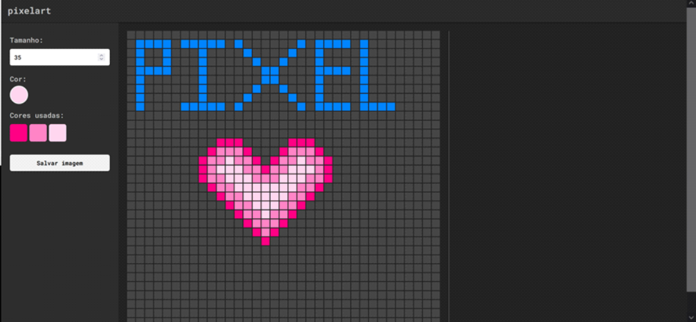

# Practice_project: Pixel Art Canvas

 <h1 align="center">
  
Pixel Art

  
<a href="https://borges-camila.github.io/PixelArt/">abrir</a>

  
</h1>

- Trata-se de um projeto simples com o objetivo de colocar meus conhecimentos de programação web em prática e desenvolver um jogo web simples.

- Projeto bastante interessante que cria a possibilidade do usuário desenhar na área destinada.

- Implementação de uma barra na lateral direita que permite que o usuário amplie ou diminua o tramanho da área de desenho.

- Implementação de barra lateral esquerda onde o usuário escolhe a quantidade de pixels, cor que deseja aplicar, armazenamento das cores utilizadas no projeto e botão de salvar a imagem no dispositivo.

## Tecnologias

- HTML, CSS e JavaScript

     <a href="https://reactjs.org/" target="_blank" rel="noreferrer">

## Aprendizados

- Criação da funcionalidade que faz o download da art criada no canvas.

## Melhorias a serem implementadas

- Borracha
- conexão com API: possibilidade de salvar o desenho e continuá-lo depois
